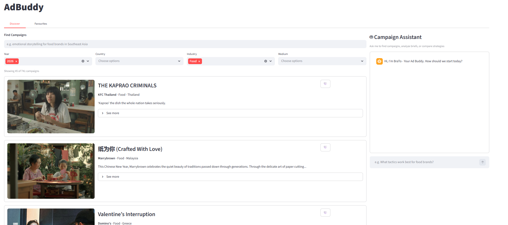
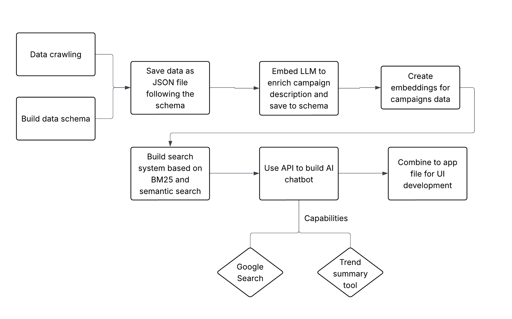

# AdBuddy — AI-Powered Ad Campaign Discovery Tool
Search, explore, and analyze 700+ real advertising campaigns using hybrid search and an AI-powered chatbot.

### Overview
Marketing professionals and scholars spend hours manually browsing ad archives to find relevant campaign references from different sources. AdBuddy solves this by aggregating campaigns from multiple award databases, enriching them with AI-generated metadata, and enabling intelligent discovery through hybrid search and a conversational chatbot.

### Key Features
1. Hybrid Search: Combines BM25 keyword matching with sentence-transformer semantic embeddings (all-MiniLM-L6-v2) for both exact and conceptual search
2. Multi-Filter System: Interactive filters by Year, Country, Industry, and Medium
3. AI Chatbot (BraTo):  GPT-4o-mini with function calling for cross-campaign trend analysis
4. AI-Enriched Metadata: Each campaign enriched via Gemini 2.5 Flash with concept summary, target audience, execution tactics, and objective
5. Favourites: Session-based bookmarking for saving campaigns of interest

### Architecture and Pipeline

